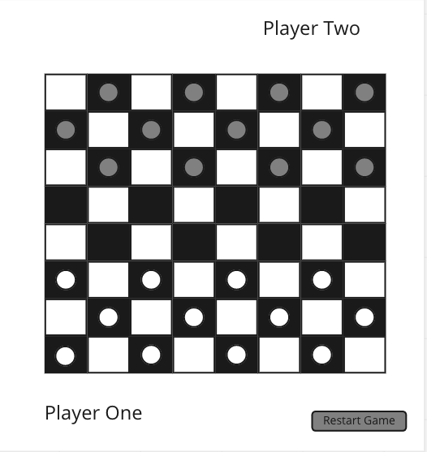

# Project 1: Checkers

## Wireframe:

## User Stories:

- As a user, I want to be able to start a game
- As a user, I want to know whose turn it is
- As a user, I want to be able to click on a piece and move it to another square
- As a user, I want to only be able to make legal moves
- As a user, I want the opponent's piece to disappear when they have been captured
- As a user, I want my piece to be promoted when it reaches the "king" row on the back
- As a user, I want to know when the game is over
- As a user, I want to know who the winner of the game was
- As a user, I want to be able to restart the game
- As a user, I want to see all legal moves when I click on a piece
- As a user, I want to be able to change the style of the board
- As a user, I want to be able to change the style of my pieces
- As a user, I want to be able to see the pieces I have captured on my side of the board
- As a user, I want to be able to keep track of wins and losses
- As a user, I want an animation when a piece gets captured
- As a user, I want to be able to display names instead of player one and player two

---

## MVP:

- As a user, I want to be able to start a game
- As a user, I want to know whose turn it is
- As a user, I want to be able to click on a piece and move to another square
- As a user, I want to only be able to make legal moves
- As a user, I want the opponent's piece to disappear when they have been captured
- As a user, I want my piece to be promoted when it reaches the "King" row on the back
- As a user, I want to know when the game is over
- As a user, I want to know who the winner of the game was
- As a user, I want to be able to restart the game

---

## Version 2:

- As a user, I want to see all legal moves when I click on a piece
- As a user, I want to be able to change the style of the board
- As a user, I want to be able to change the style of my pieces
- As a user, I want to be able to display names instead of player one and player two

---

## Version 3:

- As a user, I want to be able to see the pieces I have captured on my side of the board
- As a user, I want to be able to keep track of wins and losses
- As a user, I want an animation when a piece gets captured
- As a user, I want to be able to click and drag a piece

---

## Pseudocode:

1. **As a user, I want to be able to start a game**

    - Load the game automatically and have it initialize once the page is loaded and ready for the first move
    - Set up all of the approrpriate variables and event listeners
    - Create and run the main loop of the game on page load
 

2. **As a user, I want to be made aware of whose turn it is**

    - Create a variable that will store who's turn it is to go
    - Once one players turn is over, update that variable to the next player
    - Create a css style or animation that will let user know who is meant to go next

3. **As a user, I want to be able to click on a piece and move to another square**

    - Create a class to create the piece objects
    - Create an array to store all of the users piece objects
    - Create a property on the piece objects to hold the current location of each piece
    - Loop through all of the users pieces and create an event listener for each one
    - Once the user has clicked on a piece, place that piece in a variable called "selectedPiece"
    - Once the user has selected a piece to move, create an event listener on all of the empty squares on the board
    - Once the user selects a square on the board, change the location property for that piece to the selected square
    - Render the board to update the piece to the new location

4. **As a user, I want to only be able to make legal moves**

    - Create an object with that can be used to look for moves
    - Each of the 32 usable squares will be the keys in the object represented by a number
    - Each key will have two different arrays as their values. One for each possible move from that square for each player(each player can only move in one direction)
    - Create an array property for each of the piece objects to contain available captures
    - Create an array property for each of the piece objects to contain available moves
    - Loop through each of the users pieces and lookup which squares are visible from the pieces current location. The first array in that object can be used for player one, and the second for player two. If the piece is a king it will return both arrays since that piece can move in either direction
    - Loop through the locations returned to see if there are any opponent pieces on those squares
    - If there are any opponent pieces on those squares, check and see if the other diagonal of that square is vacant and if so place that empty location inside of the array property for captures
    - Check to see if there are any captures on any of the piece objects
    - If there are no captures, loop through all of the returned locations again and check if those squares are vacant
    - Place the number for each vacant square in the available moves property for the piece
    - If there are no available moves or captures the game is over and the user has lost
    - Once the user has moved, check to see if he has captured a piece
    - If he has just captured a piece check and see if there are anymore available captures with only that one piece

5. **As a user, I want the opponent's piece to disappear when they have been captured**

    - Give each piece object a property called "isAlive" set to true by default
    - Once a piece has been captured, set it's "isAlive" property to false
    - Set the pieces location to null
    - Render the board to remove the captured piece

6. **As a user, I want my piece to be promoted when it reaches the "king" row on the back**

    - Give each piece object a property "isKing" set to false by default
    - If the current location of any piece is currently on the back row of the board, set "isKing" to true

7. **As a user, I want to know when the game is over**

    - Loop through the users pieces to check if he has any available moves
    - If the user has no pieces that can move, end the main loop of the game
    - Everytime a piece has been captured, loop through the opponents pieces object's and see if all of the "isAlive" properties are false
    - If all of the opponents pieces are no longer in play, end the main loop for the game

8. **As a user, I want to know who the winner of the game was**

    - Once the game has ended, check which player still has pieces that are alive and display the name of the winner

9. **As a user, I want to be able to restart the game**

    - Create a restart game button 
    - Add an event listener to the restart game button
    - Restart the main loop of the game