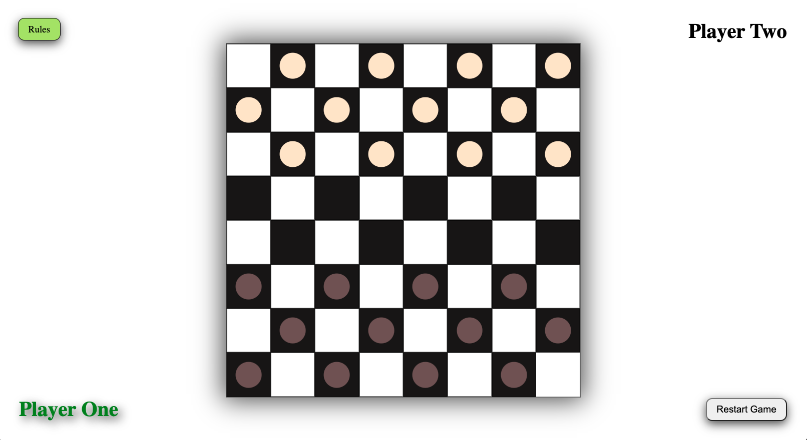
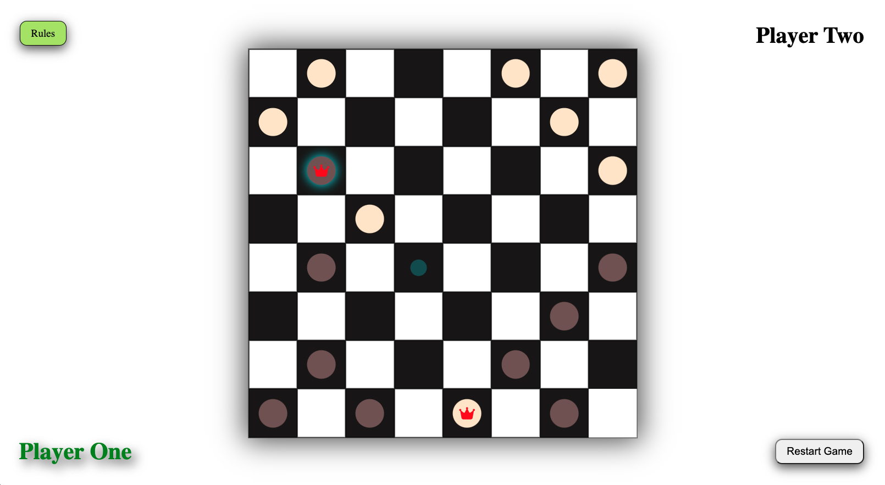

# Checkers

Checkers is a strategy based board game for two players which involves diagonal moves and mandatory captures by jumping over opponent pieces. It is played on an 8x8 board where each player has 12 pieces.

## Technology Used

---

- JavaScript
- HTML
- CSS

## Getting Started

---

To play this game click on the link [here](https://briant1312.github.io/project-1/)

Instructions: 

- The game is loaded and ready for player one to make the first move once the page is loaded
- Click a piece to select, then click on one of the highlighted squares to make your move
- If you need a refresher of the rules, click on the "rules" button to display them on screen
- Hit "restart game" button at any time to start the game over from the beginning

## Next Steps

---

### Version 2:

- As a user, I want to be able to change the style of the board
- As a user, I want to be able to change the style of my pieces
- As a user, I want to be able to display names instead of player one and player two

### Version 3:

- As a user, I want to be able to see the pieces I have captured on my side of the board
- As a user, I want to be able to keep track of wins and losses
- As a user, I want an animation when a piece gets captured
- As a user, I want to be able to click and drag a piece